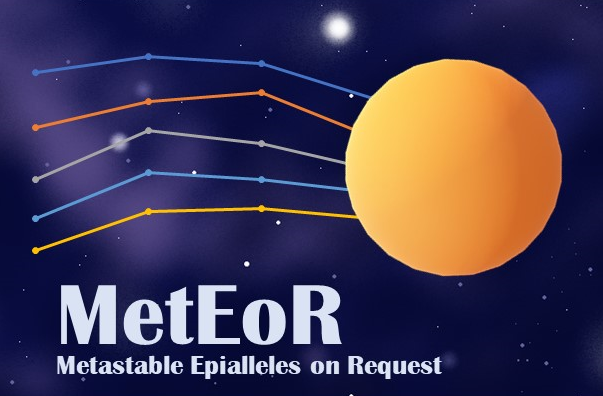
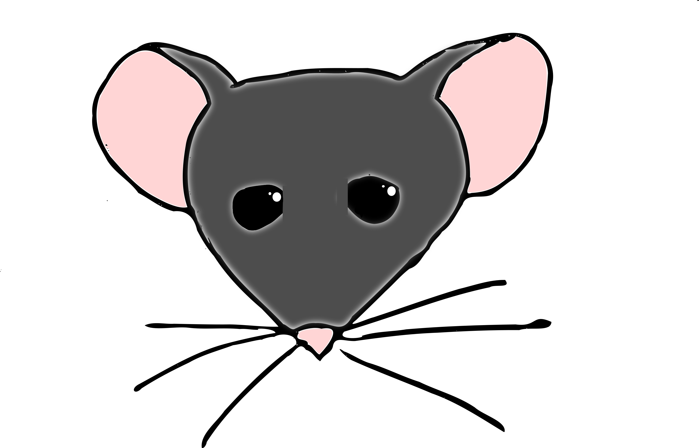
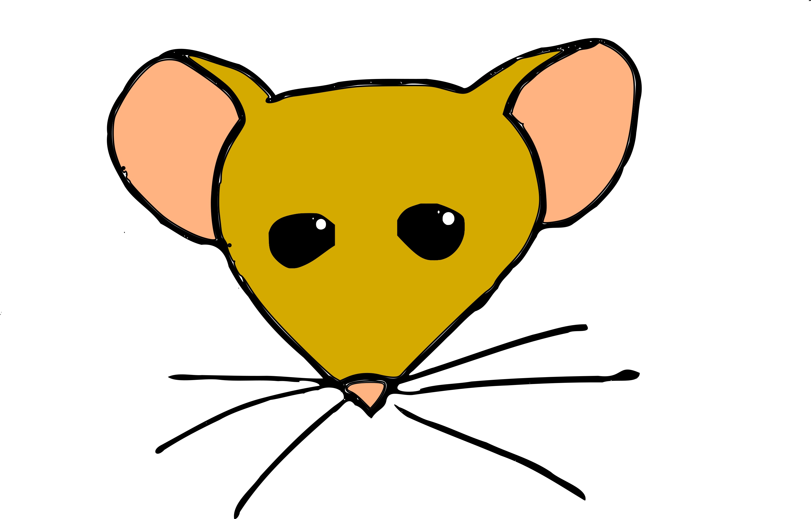
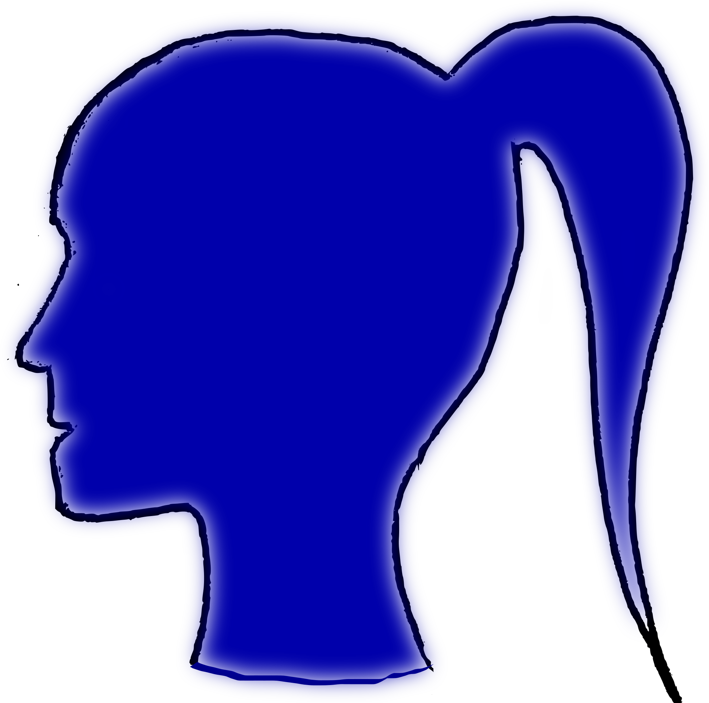

## Project Aims

Species and strains to be included:

Species      | Strain |                          |
------------ | ------ | :----------------------: | 
Mus_musculus | C57BL6 | 
Mus_musculus | CAST   | 
Homo_sapiens |        | 

## Further Reading

* Anastasiya Kazachenka, Tessa M. Bertozzi, Marcela K. Sjoberg-Herrera, Nic Walker, Joseph Gardner, Richard Gunning, Elena Pahita, Sarah Adams, David Adams, Anne C. Ferguson-Smith (2018) Identification, Characterization, and Heritability of Murine Metastable Epialleles: Implications for Non-genetic Inheritance. <i>Cell</i>, 175:5, pp1259-1271.e13 [DOI](https://doi.org/10.1016/j.cell.2018.09.043)

## Contact

[github.com/darogan/MetEor_Project](https://github.com/darogan/MetEor_Project)

[www.gen.cam.ac.uk/research-groups/ferguson-smith](https://www.gen.cam.ac.uk/research-groups/ferguson-smith)
